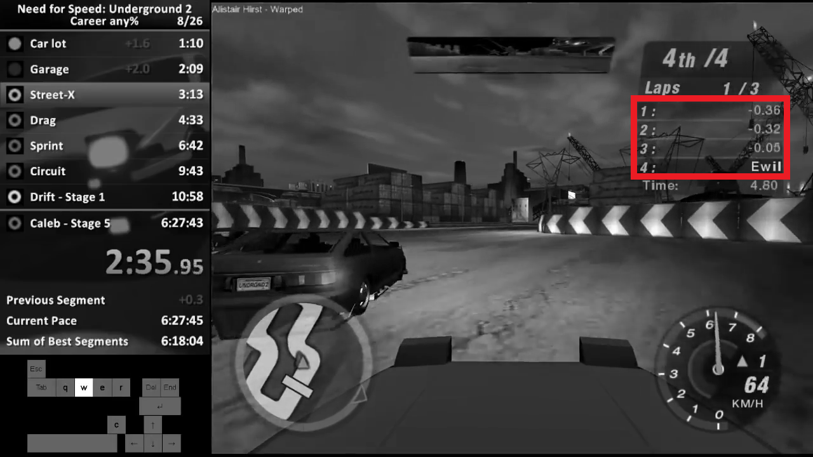
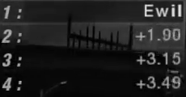

# nfsu2-ai

## Table of contents

1. [ Description ](#description)
2. [ Introduction ](#introduction)
3. [ Installation / usage ](#installation)
4. [ Credits ](#credits)

## 1. Description
The goal of this project is to let a neural network drive cars and win races in the racing game Need for Speed: Underground 2. In order to achieve this task, we will use reinforcment learning in combination with neural networks. This project is inspired by the [work of the DeepMind team using the raw pixels to train a deep neural network to play Atari games](http://arxiv.org/pdf/1312.5602v1.pdf). In addition, at least the steering and the retrieval of the pixels will be done in a similar fashion as it was done by the YouTuber [sentdex](https://www.youtube.com/user/sentdex) (see also [here](https://pythonprogramming.net/next-steps-python-plays-gta-v/)).

## 2. Introduction
Need For Speed Underground 2 is a racing game, made by EA and published in 2004 in which the player mainly competes in races against other racers. To win a race, the player has to become first in each race. In the career mode on which we will focus, a player can also earn reputation. A larger lead at the end of the race yields more reputation. This motivates us to not only become first, but also win by the largest margin possible.

The initial idea of the project is to create an AI for Need For Speed Underground 2 that is able to beat the ingame opponents on easiest difficulty in one race in the modes 'Circuit', 'Sprint', 'Street X' and / or 'Underground Racing Leauge' ('URL').
To achieve this, we will develop a neural network to determine the lead over other opponents. With the help of this information, we can reward the AI for being in front of the other racers or punish it otherwise. Hence, we will use reinforcment learning in order to train the AI. The current plan is to utilise a (deep) neural network that uses the whole window of the game and the lead over enemies as inputs for the network. These inputs will be used to determine the most optimal button presses (outputs) to gain the largest lead.

The reason behind the limitation of racing modes is that here, the leads are constantly displayed in seconds. Moreover, they are easier to handle since in other ones, there are additional 'rules'. In the case of drag races, the player has to shift gears manually and is only informed on its over all position on the leaderboard. In addition, there is no information about leads available on the screen. For drift races, the goal is to perform drifts to obtain points. Here, the leads are displayed in points. We observe that the optimal way of driving in this mode is different compared to all other modes since the focus lies on drifting.

#### Retrieval of leads

The very first goal is to obtain information about the distance that other racers are behind or in front of us. Ingame, these leads are displayed in seconds with .01s precision. As stated above, we will employ a neural network for this task. It is trained by 'feeding' it a large (~6h) [video](https://www.youtube.com/watch?v=m2Ed9cIhm4Y) of the YouTuber [EwilCZ](https://www.youtube.com/user/EwilCZ). In this video, Ewil performs a so-called speedrun of the game, in which he tries to finish the game as quickly as possible. At this moment, we are only interested in the parts where he drives a race of the category 'Circuit', 'Sprint', 'Street X' or 'Underground Racing Leauge' ('URL'). For the training, we therfore take out the segment of the video where the racing is done and examine each frame. We take each image of a frame and crop out the part where the leads are displayed (the red bordered table in the top right corner):

As we can see, there are four rows in said table: the bottom one where the name of the player (Ewil) is displayed and three with the leads over the opponents. The three rows are the ones where we get our information from. Thus, they are the ones that will be inserted into the initial neural network. To reduce the number of classes that arise, we separate each row further. As a consequence, we will further cut out five images of each row. In the following, we will refer to these images as boxes. We have highlighted the boxes of the first row in the figure below:

Each box belongs to one of the following classes: '0', '1', '2', '3', '4', '5', '6', '7', '8', '9', '+', '-', 'void', 'ewil' and 'name'. The labels '0' to '9' are used for the respective integers while 'void' is used to show that this box does not contain any information. 'ewil' is the name of the player in our case, and 'name' is used for boxes containing letters of the names of opponents. Thus, the boxes in the first row in the image above are labeled from left to right: 'void', '-', '0', '3', '6'  

The five boxes of one row together contain all the necessary information regarding the respective opponent. The box in the center and the one on its left-hand side yield the lead in seconds. Depending on the size of the gap, the more left one of these two images may also display a positive or negative sign. Leads are denoted by a plus sign, while minus signs are used if the player is behind an opponent. For large leads, a plus sign may be found in the left most box. To give more accurate rewards, we will also include the two boxes on the right. They specify the lead on a sub-second level. They will be more relevant in later stages of the training if the player competes against enemies on higher difficulties.  

Currently, the [data set](./training_data_314.data) contains 11260 images from the first race in [aformentioned video](https://youtu.be/m2Ed9cIhm4Y?t=160). The images come from the first 19s of said race. In the video, the race starts at 2:40 and ends at 3:14. The point in time of the end of the race is used as a name (this particluar race is referred to as 'race 314').

## 3. Installation / Usage
In this section, we give a short explanation on the steps necessary to obtain a classifier for the boxes using a [data set](./training_data_314.data). Simply put, we only need to execute the file [TrainClassifierLeads.py](./TrainClassifierLeads.py). It will fetch the data set from `C:\ML\nfsu2_data\data\training_data_314.data`, train a simple neural network and save it as `C:\ML\nfsu2_data\models\reward_classifier_epochs_3.h5` (the '3' in the name indicates the number of epochs used for training). It has an accuracy of approximately 98\% (which is most likely caused by the homogeneity of the data).  
As a next step, the obtained classifier will be implemented to extract the leads during the game.

## 4. Credits

The creation of the images and the labeling of the images has been done by Timo Lohrmann.
